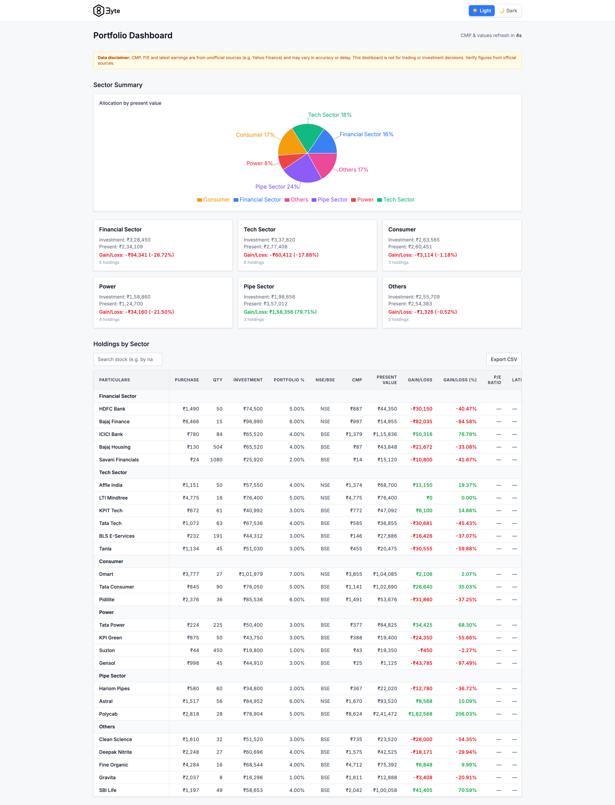

# 8byte.ai

The screenshot above shows the Portfolio Dashboard: sector summary with allocation donut chart, sector detail cards (investment, present value, gain/loss), and the holdings-by-sector table with search and CSV export.

---

https://eightbyte-ai.onrender.com/api-docs/#/

   npx firebase login
   npx firebase init
   

   # 1. Build the frontend (output goes to dist/)
npm run build

# 2. Deploy to Firebase Hosting
npx firebase deploy

## Stack Summary

| Layer    | Tech |
|----------|------|
| Frontend | React 19, TypeScript, Vite, Tailwind CSS, Redux Toolkit, React Router |
| Backend  | Node.js, Express, TypeScript |
| Hosting  | **Frontend:** Firebase Hosting · **Backend:** Render |
| Market   | yahoo-finance2 (CMP, P/E, earnings date) |
| Data     | JSON seed (from Excel structure); in-memory cache for market data |

**Live URLs**

- **Frontend:** [https://byteai-b065b.web.app/](https://byteai-b065b.web.app/)
- **Backend API docs:** [https://eightbyte-ai.onrender.com/api-docs/#/](https://eightbyte-ai.onrender.com/api-docs/#/)

---

## Portfolio Dashboard

